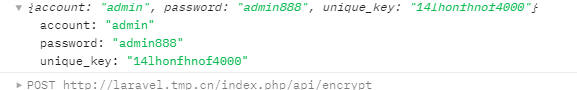

# aes对称加密
####
配置文件
######
在config目录下创建文件 aes.php
####
```
<?php
return [
    "aes_key" => "c2rFIU3ym8AXJ1aU",//aes加密key
    "repeat_click_time" => 10,//防止重复点击时间
];
```
#####
不创建和配置key系统默认'robertvivi'
#
使用方法
#####
```
//加密
$as = Aes::init('c2rFIU3ym8AXJ1aU')->encrypt(json_encode($data));
//解密
Aes::init('c2rFIU3ym8AXJ1aU')->decrypt($as);

```
####
加密数据自动转换成明文
使用中间件
在 app/Http/Kernel.php 中配置中间件:例如配置在api分组中
```
protected $middlewareGroups = [
        'web' => [
            \App\Http\Middleware\EncryptCookies::class,
            \Illuminate\Cookie\Middleware\AddQueuedCookiesToResponse::class,
            \Illuminate\Session\Middleware\StartSession::class,
            // \Illuminate\Session\Middleware\AuthenticateSession::class,
            \Illuminate\View\Middleware\ShareErrorsFromSession::class,
            \App\Http\Middleware\VerifyCsrfToken::class,
            \Illuminate\Routing\Middleware\SubstituteBindings::class,
        ],

        'api' => [
            'throttle:60,1',
            \Illuminate\Routing\Middleware\SubstituteBindings::class,
            AesMiddleware::class
        ],
    ];
```
####
重复点击验证需要传递unique_key字段

